Omniscient Cookies
==================

A diverse visual and QoL mod for Cookie Clicker.

There are a variety of different features, most of which are simply  
small enhancements or tweaks that improve the gameplay without being intrusive.  
Nearly everything can be toggled on or off at will, though most start enabled.

Using the mod
-------------

Omniscient Cookies is still gaining new features!  
As usual, it may be a good idea to **back up your save** just in case.  
However, most features **do not** directly impact the game mechanics.

To load Omniscient Cookies, you can simply add  
<https://gamrguy.github.io/OmniscientCookies/OmniscientCookies.js>  
to [Cookie Clicker Mod Manager](https://github.com/klattmose/CookieClickerModManager).

Alternatively, you can use the following command in the Javascript console, a userscript, or a bookmarklet:
```js
Game.LoadMod('https://gamrguy.github.io/OmniscientCookies/OmniscientCookies.js');
```

Graphical enhancements
======================

Autohide center scrollbar (enabled by default)
----------------------------------------------

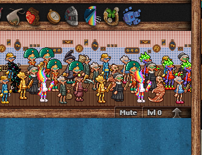

A small CSS tweak that automatically hides the scrollbar in the center panel when enough buildings have been muted.

Building scroll (enabled by default)
------------------------------------


Hovering over the left or right of a building will begin scrolling.  
Now you can see the true extent of your grandma army!

Smooth buildings (enabled by default)
-------------------------------------
Makes buildings draw every frame instead of every three frames.  
This greatly improves the smoothness of hovering over grandmas and the **Building scroll** feature.

Improved buff tooltip visuals (not toggleable)
----------------------------------------------
Disables text wrapping within buff tooltips so text doesn't get chopped into the next line.  
Also fixes the clipping that occurs with the feather icons in buffs with long titles.  
Additionally, when a buff is updated with a new maximum time, the tooltip description updates to match.

Improved building tooltips (enabled by default)
-----------------------------------------------

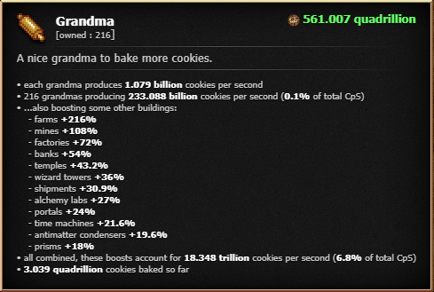

Much like the buff tooltips, this disables text wrapping to stop text getting chopped.  
Additionally, expands the synergy description in certain buildings to a list.

Grandma synergy upgrade fixes (enabled by default)
--------------------------------------------------
Places the "for every X grandmas" section on a new line so it doesn't get chopped by text wrapping.  
Additionally, fixes the order of the appearance of these upgrades in the stats menu.
Also fixes the order of the buildings in the Grandma building tooltip synergy list.  
ALSO makes buying Script grannies trigger a redraw, like the other synergies.

Bring grandma to work day (enabled by default)
----------------------------------------------


It's getting pretty cramped in the grandma office, isn't it?  
Give those extra grandmas some breathing room by taking them to work!  
The amount of visible synergy grandmas is dependent on the value scaling of the correlating synergy bonus.

Script grannies are introverts and stay home. The Matrix isn't suitable for humans anyway.

Separate tech upgrade category (enabled by default)
---------------------------------------------------

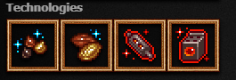

Gives technology upgrades from the Research Center their own category in the Stats menu.  
Find it right under the Cookies category!

Separate seasonal upgrade category (disabled by default)
--------------------------------------------------------

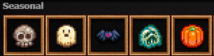

Gives seasonal upgrades from Christmas, etc. their own category in the Stats menu.  
Find it right under the Cookies category, or the Technologies category if that's also enabled!

Display seasonal sources (enabled by default)
---------------------------------------------

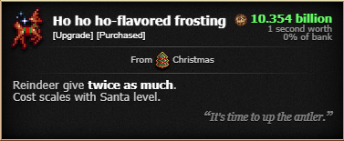

Shows the seasonal requirement of seasonal upgrades in their tooltips.

Fancy milk select (enabled by default)
--------------------------------------


The icon of the milk selector switch switches with your selected milk.

Tooltip wobble (disabled by default)
------------------------------------
Enables the tooltip wobble animation, which is disabled in vanilla.  
Does it look much good? Not really. Fun to try? Maybe.

Fancy ascend meter (enabled by default)
---------------------------------------


Overhauls the ascend meter's filling formula to fill faster, smoother, 
work properly with negative ascension gains (from **Dangerous stocks**),
and to provide a tangible sense of speed.

*May* cost performance. *Probably* won't.

Buildings/cursors/wrinklers always fancy/fast/default (default by default)
--------------------------------------------------------------------------

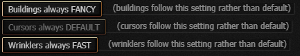

Allows buildings and/or cursors to ignore the Fancy setting.  
This can help fine-tune your performance or visual style a bit further.  
Most notably helps with using **Building scroll** while Fancy is off.

Quality of Life enhancements
============================

Enhanced buying in bulk (enabled by default)
--------------------------------------------

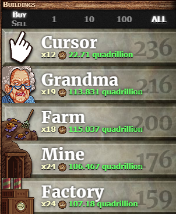  
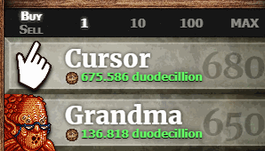

Technically, the vanilla game allows partial buying in bulk, but greys out the buildings so it's not obvious.  
This fixes that bug, allowing you to properly see how many buildings you can purchase and for how much.  
Additionally, this allows using the "ALL" button when buying buildings, and makes "ALL" *mean* ALL, not 1000!  
*Additionally*, you can now hold both SHIFT and CTRL at the same time to shortcut the MAX/ALL button.

Show buff duration in tooltip (enabled by default)
--------------------------------------------------

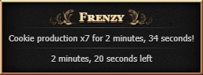

Displays a buff's remaining duration in its tooltip.  
Serves as an unintrusive, immersive alternative to Cookie Monster or Klattmose's Timer.

Stock Market tweaks
===================

Stock average value data (enabled by default)
---------------------------------------------

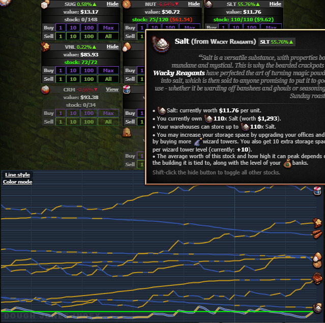

When buying stocks, records the average value of the price you bought them at.  
You can then check this number against the current value to see whether you'll be making a profit.  
This is also shown on the graph as a green line when hovering over a particular stock.

Dangerous stocks (disabled by default)
--------------------------------------
In the vanilla game, buying and selling stocks has little effect on your cookies earned.  
With this modifier, you're gambling not just your current cookies, but your earned cookies as well.  
This means you can actually *lose* ascension progress, but *gain* it as well, if you play your cards right!

Dangerous brokers (disabled by default)
---------------------------------------
When you hire a broker, reduces your market profits by $1200.  
This makes hiring brokers consistent with other Stock Market mechanics,  
and lets you know whether you've made back on your investment.

If **Dangerous stocks** is also enabled, hiring brokers takes from your total cookies baked!  
Watch out!

Pantheon tweaks
===============

Cyclius details (enabled by default)
------------------------------------

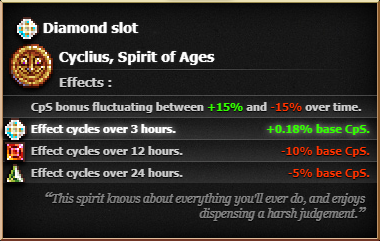

Shows the current values of Cyclius' cycles in his tooltip.

Timezoned Cyclius (disabled by default)
---------------------------------------
Shifts Cyclius' cycles based on your timezone.  
Time is shifted towards GMT+1, such that the 24h cycle zeroes out at 1:00 and 13:00.  
Just like what Orteil is seeing!

True Cyclius (disabled by default)
----------------------------------
Cyclius gets to show off his power with style!
This is a purely cosmetic option.

Grimoire options
================

Improved magic meter (enabled by default)
-----------------------------------------
Slight graphical improvements to the magic meter.  
Fixes the lack of horizontal scaling and properly occludes overflow.

Experimental options
====================

Buildings draw smart (experimental; disabled by default)
--------------------------------------------------------
Attempts to drastically reduce the performance impact of drawing  
the building displays by skipping unnecessary draw frames.  
May improve performance with no cost to visuals.

Wrinkler preservation (experimental; disabled by default)
---------------------------------------------------------
Normally, the game only saves the overall stats of your wrinklers.  
When you refresh the game, wrinklers are placed in a defined order with cookies evenly split between them.  
This setting intends to restore all of the wrinkler stats.  
To prevent wrinkler duplication, this attempts to only apply if the difference between versions is within 0.1%.

Cursed Finger tweaks (experimental; disabled by default)
--------------------------------------------------------
A pair of experimental tweaks to Cursed Finger:  
- Does not snapshot your CpS; is affected by buffs/changes after gaining the buff
- CpS gained from CF is considered "passive" CpS and is eaten by wrinklers and counted for building production totals

Note that the wrinkler synergy significantly increases the power of Cursed Finger.  
Don't use this option if you want it to still feel like a debuff.

OptiCookies (experimental; disabled by default)
-----------------------------------------------
Applies some experimental performance enhancements that may or may not be compatible with other mods.

Currently, this includes:
- Replaces building price calculations with non-looping formulas
- Fixes constant store refreshes being triggered by false upgrade sorting checks